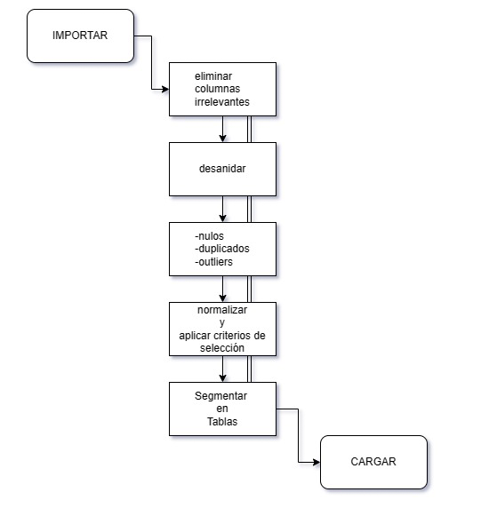
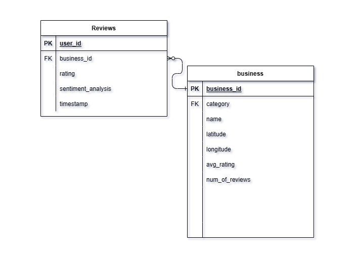

<h1 align="center">🍽️ `YELP & GOOGLE MAPS REVIEWS ` 🗺️</h1>

## 📋 **Tabla de contenidos**
- [Contexto](#Contexto)
- [Objetivos](#Objetivos)
- [MPV](#MVP)
- [Alcance del proyecto](#Alcance-del-proyecto)
- [Limitaciones del proyecto](#Limitaciones-del-proyecto)
- [KPI's](#KPI´s)
- [Metodología de Trabajo](#metodologia-del-trabajo)
- [Stack Tecnológico](#Stack-Tecnológico)

<!-- Contexto section -->
##  **Contexto**

Como parte de una consultora de data, nos han contratado para poder realizar un análisis del mercado estadounidense. Nuestro cliente es parte de un conglomerado de empresas de restaurantes y afines, y desean tener un análisis detallado de la opinión de los usuarios en Yelp y cruzarlos con los de Google Maps sobre hoteles, restaurantes y otros negocios afines al turismo y ocio, utilizando análisis de sentimientos, predecir cuáles serán los rubros de los negocios que más crecerán o decaerán. Además, desean saber dónde es conveniente emplazar los nuevos locales de restaurantes y afines, y desean poder tener un sistema de recomendación de restaurantes para los usuarios de ambas plataformas para darle al usuario, por ejemplo, la posibilidad de poder conocer nuevos sabores basados en sus experiencias previas.

<!-- objetivos section -->
## **🎯 Objetivos**
### **🌟 Objetivo General 1**

Desarrollar un sistema de recomendación de restaurantes que satisfaga las necesidades y preferencias de los usuarios.   

### **🔍 Objetivos específicos**

1. Recomendar restaurantes similares a otros que hayan tenido éxito utilizando técnicas de filtrado colaborativo.

2. Recomendar restaurantes que se ajusten a los gustos y preferencias de los usuarios utilizando modelos basados en contenido.

### **🌟 Objetivo General 2**
Identificar la zona más conveniente para emplazar nuevos locales mediante el análisis geoespacial y técnicas de correlación, con el fin de tomar decisiones estratégicas que optimicen el rendimiento de un posible nuevo negocio.

### **🔍 Objetivos específicos**
1. Analizar datos de ubicación geográfica, demográficos para identificar variables que puedan correlacionarse con el éxito de un negocio.

2. Evaluar las relaciones de correlación entre estas variables y el rendimiento pasado de negocios similares en diferentes áreas geográficas.

3. Seleccionar la zona más prometedora para la expansión del negocio basándose en las correlaciones identificadas.

### **🌟 Objetivo General 3**
Utilizar técnicas de análisis de datos para comprender mejor el comportamiento futuro del mercado en un rubro turístico dado.

### **🔍 Objetivos específicos**
1. Determinar las variables que más influyen en el crecimiento o decrecimiento de los negocios.

2. Identificar tendencias en las ventas o ingresos de diferentes rubros de negocios mediante el análisis de series temporales con modelos ARIMA.

### **🌟 Objetivos Comunes**

1. **Extracción de datos desde la fuente:** Utilizaremos las API´s provistas por Yelp y google maps y datos recolección propia/scrapping para las variables demográficas.

2. **Disponibilizar datos en la nube:** Implementaremos un proceso de carga incremental con servicios de GCP. Asi los datos podrán ser consumidos por nuestra plataforma.

3. **Limpieza de Datos:** Corregir valores atípicos, datos faltantes y normalizar los datos, asegurando la integridad de los mismos antes de la análisis.

4. **Automatización:** Automatizar tanto como sea posible el proceso de ETL para mejorar la eficiencia y reducir el riesgo de errores manuales.

5. **Documentación:** Documentar detalladamente todo el proceso de ETL, incluyendo las fuentes de datos, las transformaciones realizadas y los criterios de calidad aplicados, para facilitar la replicabilidad y el mantenimiento del proceso.

(<a href="#readme-top">volver arriba</a>)

<!-- mpv section -->
## **🚀 MPV**  

El Producto Mínimo Viable (MVP) debe ser una Interfaz de usuario  que proporciona las características elaboradas en los objetivos.
La interfaz de usuario deberá ser intuitiva y fácil de usar, permitiendo a los usuarios acceder a estas funcionalidades de manera clara y efectiva. Además, deberá ser capaz de mostrar los resultados de manera visualmente atractiva, mediante gráficos, mapas y listas de recomendaciones.

<!-- Alcance section -->
## **🌐 Alcance del proyecto**

**Extracción de Datos:** Recopilar y utilizar datos de plataformas de reseñas como Google Maps y Yelp.

**Análisis de Datos:** El sistema utilizará técnicas avanzadas de Analisis de Datos y Aprendizaje Automático  para analizar las reseñas de los usuarios. Este análisis permitirá al sistema identificar tendencias y realizar recomendaciones consistentemente.

**Cobertura Geográfica:** El sistema se centrará específicamente en los locales de comida en los estados de California, Florida y Nueva York en los Estados Unidos.

**Visualización y Sistema de Recomendación:** El sistema proporcionará una interfaz de usuario intuitiva que permite a nuestros clientes seleccionar su criterio de restaurantes, visualizar los resultados de la recomendación y proporcionar retroalimentación.

**Iteración y Mejora:** Con la retroalimentación de los usuarios, el sistema será iterado y mejorado continuamente para satisfacer mejor las necesidades de los usuarios.

<!-- Fuera de alcance section -->
## **❌ Limitaciones del proyecto**

**Datos en tiempo real:** Dependiendo de las limitaciones de las API de Google Maps y Yelp, puede que no podamos obtener datos en tiempo real. Esto podría afectar la capacidad del sistema para identificar las tendencias más recientes.

**Personalización profunda:** Si bien podemos personalizar las recomendaciones basándonos en las reseñas, puede que no podamos personalizarlas en función de las preferencias dietéticas individuales o las restricciones alimentarias de los usuarios por falta de datos.

**Escalabilidad:** Aunque el sistema está diseñado para escalar y cubrir otras regiones, la implementación inicial se limitará a California, Florida y Nueva York. La expansión geográfica podría estar fuera del alcance inicial del proyecto. Lo mismo vale para extrapolar el modelo a otros rubros comerciales o áreas afines.

 <!-- KPI section -->
## **📊 KPI´s:**

• **Crecimiento de reseñas positivas:** 
* **Descripción**: Este KPI se centra en el aumento porcentual del número de reseñas positivas en comparación del año anterior.
* **Objetivo**: Aumentar 5% las reseñas positivas para los negocios en comparación con el año anterior.

$$
\mathrm{KPI} = \frac{R_{\text{añoActual}}^{+} - R_{\text{añoAnterior}}^{+}}{R_{\text{añoAnterior}}^{+}} \cdot 100
$$

 

• **Disminución de reseñas negativas:** 
* **Descripción**:Este KPI se centra en la disminución porcentual del número de reseñas negativas en comparación del año anterior.
* **Objetivo**: Disminuir 5%  la tasa de reseñas en comparación con el año anterior.

$$
\mathrm{KPI} = \frac{R_{\text{añoAnterior}}^{-} - R_{\text{añoActual}}^{-}}{R_{\text{añoAnterior}}^{-}} \cdot 100
$$

 

• **Aumento de la tasa anual de retención de usuarios:** 
* **Descripción**:Mide la tasa de usuarios que escriben reseñas año a año.
* **Objetivo**: Aumentar 5%  la tasa de reseñas en comparación con el año anterior.

$$
\mathrm{KPI} = \frac{U_{\text{ReseñasActual}}- U_{\text{ReseñasAnterior}}}{U_{\text{ReseñasAnterior}}}
$$

 

<!-- flujo section -->
## **🔧 Flujo de Trabajo**

Lo primero que realizamos al recibir los datos en crudo es un trabajo de etl manual y estandarizado a traves de python y las librerias pertinentes. Este etl inicial consta de la eliminacion de las columnas irrelevantes, si es necesario desanidamos columnas, manejamos los valores nulos y duplicados, normalizamos tipos de datos y los nombres de las columnas para estandarizar segun el esquema que se adapta a nuestros objetivos y finalmente se segmentamos las tablas segun corresponda.

A partir de aca los datos sigues dos caminos diferentes y vuelven a encontrar en el producto final. Por un lado tenemos los datos que seran untilizados para entrenar los sistemas de recomendaciónn por filtrado colaborativo y  filtrado basado en contenido.  Los mismos se implementaran sobre fast api, utilizando streamlit como interface y google app engine para el deploy. Por otro lado, en el segundo camino de los datos, Luego del etl inicial, los datos pasan a un bucket especifico de google cloud storage donde funcionan como trigger para el inicio de las funciones de google cloud functions que ingestara las tablas en big query.
La funcion verifica si se trata de un archivo csv y de ser asi lo carga de forma temporal y pasa a validar si coincide con el esquema asignado para la tabla de bigquery, de ser asi comienza a subir los datos en otra tabla temporal en big query en donde se realizara un merge con la tabla original si es que se cumplen ciertas condiciones. En ambas tablas solo se cargaran los datos si no estan en tabla original, proceso conocido como carga incremental.pero la tabla reviews y business difieren en las condiciones del merge. El criterio utilizado para la tabla reviews es que que si los datos que se intentan agregar difieren en user_id y timestamp se agregan enfectivamente, asumiendo como supuesto logico que el mismo user puede haber realizado mas de una reseña pero nunca exatamente al mismo tiempo. En el caso de la tabla business la condicion para añadir los datos es que el business_id sea diferente y tambien la latitud y longitud, asumiendo que pueden haber varios locales emplazados en lugares diferentes. Finalmente una vez subidos a bigquery estos se conectan directamente con looker para disponibilizar los datos de forma integrada y utilizarlos en la construccion de un dashboard estrategico que luego sera embebido en el el producto final, esto es, la interface de usuario, encontrandose en el mismo punto los dos caminos iniciales que tomaron los datos luego del etl inicial.

Junto al codigo de las funciones en el repositorio se puede encontrar un README.md en la sub-carpeta ML de la carpeta "Sprint 3 Machine Learning y Analitics" donde se explica con precision el desarrollo y funcionamiento del modelo de Machine Learning.

## Diagrama E-R

Por lo que respecta al diccionario de datos este se encuentra en el readme.md de la carpeta "Sprint 2 Ingenieria de Datos"

<!-- metodología section -->
## **🔧 Metodología del Trabajo**

La metodología Scrum divide el trabajo en partes pequeñas y manejables llamadas "sprints". Cada sprint dura un período de tiempo corto, en este caso una semana, durante el cual el equipo se enfoca en completar un conjunto específico de tareas. Al final de cada sprint, se realizará una demo (sprint review meeting) en la que se hará una demostración de los entregables desarrollados, esperando una retroalimentación. Se ajusta así la planificación para el siguiente sprint según lo que se haya aprendido. Además, cada día se realizarán reuniones diarias de seguimiento (Daily Standup), para discutir el progreso diario y posibles inconvenientes. Todo esto permite una adaptación continua a medida que el equipo avanza.

**Sprint 1 - Comprensión del Negocio y de los Datos**:

**Sprint 2 - Preparación de los Datos y Modelado**: 

**Sprint 3 - Evaluación y Despliegue**: 

<!-- stack section -->
## **💻 Stack Tecnológico**

**Visual Studio Code:** Software para trabajar de forma local en el proyecto.

- **Bases de datos:** Azure o PostgreSQL para almacenar los datos, MongoDB para datos no estructurados como reseñas de usuarios.

- **Lenguajes de programación:** Python para análisis de datos y desarrollo de modelos de machine learning.

- **Bibliotecas y frameworks:** pandas, scikit-learn, TensorFlow / PyTorch para machine learning, Flask o FastAPI para desarrollar APIs.

- **Herramientas de visualización:** Matplotlib, Seaborn, Plotly para visualización de datos.

<!-- team section -->
## **👥 Miembros del Equipo**

| Rol            |  Nombre              | LinkedIn | GitHub |
| -------------- |--------------------- | -------- |-|
| Data Engineer  | Sebastian Rosenblunn      | [![LinkedIn][linkedin-shield]][linkedin-Naza]  | [![GitHub][github-shield]][github-Naza]  |
| Data Scientist | Nazareno Fantin | [![LinkedIn][linkedin-shield]][linkedin-Sebas] | [![GitHub][github-shield]][github-Sebas] |
| Data Scientist | Alejo Diez Gomez     | [![LinkedIn][linkedin-shield]][linkedin-Alejo]   | [![GitHub][github-shield]][github-Alejo]   |
| Data Analyst   | Keyla Serna          | [![LinkedIn][linkedin-shield]][linkedin-Keyla] | [![GitHub][github-shield]][github-Keyla] |
| Data Analyst   | Tomás Basovich       | [![LinkedIn][linkedin-shield]][linkedin-Tom] | [![GitHub][github-shield]][github-Tom] |
<!-- | Project Management  | Scrum Master   |  |Maximiliano Vaca Coll |       ||-->

(<a href="#readme-top">volver arriba</a>)

<!-- MARKDOWN LINKS & IMAGES -->
<!-- https://www.markdownguide.org/basic-syntax/#reference-style-links -->

[linkedin-shield]: https://img.shields.io/badge/LinkedIn-0077B5?style=for-the-badge&logo=linkedin&logoColor=white
[github-shield]: https://img.shields.io/badge/GitHub-100000?style=for-the-badge&logo=github&logoColor=white

[linkedin-Naza]: https://www.linkedin.com/in/nazareno-fantin/
[linkedin-Sebas]:https://github.com/Nazario3482/Proyecto-Grupal-Google-yelp  
[linkedin-Alejo]:https://www.linkedin.com/in/alejo-gabriel-diez-gomez-402b93254/
[linkedin-Keyla]:www.linkedin.com/in/keyla-elyneth
[linkedin-Tom]:https://github.com/Nazario3482/Proyecto-Grupal-Google-

[github-Naza]: https://github.com/Nazario3482
[github-Sebas]:https://github.com/Nazario3482/Proyecto-Grupal-Google-yelp
[github-Alejo]:https://github.com/AlejoDiezGomez
[github-Keyla]:https://github.com/KeylaSernaB
[github-Tom]:https://github.com/Nazario3482/Proyecto-Grupal-Google-yelp
